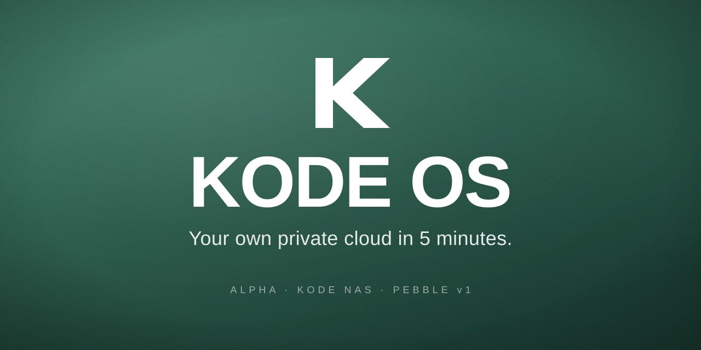

# KODE OS

> Your own private cloud, in a box the size of a paperback.

**KODE OS** is the operating system that ships on the [KODE NAS pebble](https://kodenas.dev) — a small, beginner-friendly home NAS appliance built around a Raspberry Pi 5. It turns the Pi into a private cloud for your photos, files, and media, without the Synology price tag or the DIY Pi-build complexity.

> ⚠️ **alpha** — this release is for early adopters and developers. APIs, defaults, and the install path will change. Don't run it on hardware you can't reflash.

KODE OS is a fork of [CasaOS](https://github.com/IceWhaleTech/CasaOS) with a customized UI, an OLED display daemon, a first-boot setup wizard, and per-app onboarding walkthroughs designed for non-technical buyers.

---

## What's in the box (the software box)

- **Flashable image** — a single `.img.xz` you write to an SD card with Raspberry Pi Imager and boot. No SSH, no installer to run, no command line.
- **First-boot service** — fires once on first power-on: expands the root filesystem to fill the SD card, waits for real internet (clear OLED message if Ethernet's unplugged), bootstraps CasaOS, mints a random wizard token, shows the wizard URL on the OLED + MOTD. Self-disables on success.
- **Dashboard** — a tile-based home screen with clock, weather, file shortcuts, family-member profiles, system monitor, network status, photo-of-the-day, and per-app launchers. Six pre-made layouts plus full drag-and-drop customization.
- **First-boot wizard** — language → system check → admin account → pebble name → app picker → layout chooser → install → per-app walkthroughs → done. Designed to take five minutes.
- **App walkthroughs** — guided setup for Immich, Jellyfin, File Browser, Pi-hole, and Home Assistant. Each one opens the app, walks the user through account creation + mobile-app connect + recommended settings + a "you're done" screen.
- **Family-member profiles** — per-profile dashboard layouts, optional per-member passwords, role hierarchy (viewer / editor / admin), all stored locally and synced via the CasaOS user-service custom storage.
- **OLED display daemon** — a Python daemon driving a 2.08" SH1122 OLED over SPI, cycling through hostname/IP, storage, system status, and live app data (Immich photos backed up, Pi-hole ads blocked, Jellyfin now-playing). Status-card mode during first-boot walks the buyer through the install in real time.
- **`kode-os` device CLI** — `sudo kode-os update` (pull + re-run installer), `sudo kode-os uninstall` (with `--purge` / `--wipe-data` tiers), `kode-os version`.

---

## Hardware

| Component | Recommended |
|---|---|
| **Computer** | Raspberry Pi 5 (4 GB) |
| **Storage** | 64 GB+ microSD or M.2 NVMe via Pi 5 HAT |
| **OS** | Raspberry Pi OS Lite (64-bit, Bookworm) |
| **Display** | Waveshare 2.08" SH1122 OLED on SPI0 *(optional)* |
| **Network** | Ethernet preferred (Wi-Fi works too) |

The pebble v1 also ships with a custom case + power button + USB-C PSU — those are hardware-side, not part of this repo.

---

## Install

### Flash + boot (recommended)

1. **Download** the latest `kode-os-*-pi5-lite.img.xz` from [the latest release](https://github.com/KodeNAS/kode-os/releases/latest).
2. **Flash** the `.img.xz` to a microSD card with [Raspberry Pi Imager](https://www.raspberrypi.com/software/) — pick **"Use custom"** and point it at the file. Skip the customization screen unless you need Wi-Fi credentials baked in (the image already has hostname `pebble`, SSH off, no usable login — the wizard creates the admin).
3. **Boot** the Pi 5 with Ethernet plugged in. Wait ~3-5 min on first power-on while it expands the filesystem + bootstraps CasaOS.
4. **Open** `http://pebble.local/` in any browser on the same network. The router auto-redirects to the wizard URL.
5. Set up admin account, pick apps, follow the walkthroughs.

If you have the SH1122 OLED wired up, it walks through every step: "WAITING FOR NETWORK" → "SETTING UP / Installing CasaOS" → "OPEN IN BROWSER".

**Verifying the image** — every release ships a `.sha256` alongside the `.img.xz`:

```bash
sha256sum -c kode-os-*-pi5-lite.img.xz.sha256
```

### Update

Once installed, KODE OS gives you a `kode-os` CLI:

```bash
sudo kode-os update    # pull latest from GitHub + re-run the installer
sudo kode-os version   # show installed version
```

The installer is idempotent — re-running it only changes what's actually different.

### Uninstall

```bash
sudo kode-os uninstall              # remove KODE OS + OLED daemon + CasaOS runtime
sudo kode-os uninstall --purge      # also remove KODE-installed Docker apps + the kode user
sudo kode-os uninstall --wipe-data  # also delete /DATA (requires typing WIPE to confirm)
```

The bare `uninstall` leaves Docker, `/DATA`, and CasaOS-pulled system packages alone.

---

## Building the bootable image

The image is built with [pi-gen](https://github.com/RPi-Distro/pi-gen) (the Pi Foundation's image-build framework) plus our custom `stage-kode-os/` that layers KODE OS on top of Pi OS Lite Bookworm arm64. Everything lives in `image-build/`.

Quick start (Linux host with Docker + 20 GB free disk):

```bash
cd image-build
./build.sh                  # slim image, 30-60 min, outputs to /tmp/kode-pi-gen-work/deploy/
./build.sh --with-apps      # bundled-apps variant (deferred to v0.2.1)
./build.sh --debug-ssh      # SSH-enabled variant with your ~/.ssh/id_ed25519.pub baked in
```

Full build internals + GitHub Actions setup live in [`image-build/README.md`](image-build/README.md).

---

## Building from source (developers only)

If you'd rather layer KODE OS onto an existing Pi OS Lite install instead of flashing the image — for example to iterate on the UI or test changes — the v0.1.x install path still works:

```bash
git clone https://github.com/KodeNAS/kode-os.git
cd kode-os
sudo ./scripts/install.sh
```

The script installs Docker (if missing), the upstream CasaOS runtime, builds the KODE OS UI, overlays it onto the CasaOS web root, and (if `/dev/spidev0.0` exists) installs the OLED daemon. Use this only for development — buyers should flash the image.

---

## Project layout

```
kode-os/
├── README.md            this file
├── LICENSE              Apache 2.0
├── NOTICE               attribution to upstream projects
├── PRIVACY.md           data the OS handles + sends nowhere
├── SECURITY.md          how to report vulnerabilities
├── CONTRIBUTING.md      contribution guide
├── CHANGELOG.md         release notes
├── assets/              branding (logos, favicons, wallpapers)
├── docs/                developer documentation
├── image-build/         pi-gen-based bootable image pipeline
├── pebble/              OLED daemon + systemd unit + helper scripts
├── releases/            archived release notes per tag
├── scripts/             install, HTTPS setup, deploy helpers, kode-os CLI
├── .github/workflows/   GitHub Actions (auto-builds image on tag pushes)
└── kode-os-ui/          (separate repo) the Vue 2 dashboard UI
```

The UI lives in its own repo at [KodeNAS/kode-os-ui](https://github.com/KodeNAS/kode-os-ui) — the installer clones it, builds it, and copies the production assets onto the pebble.

---

## Privacy

KODE OS does not phone home. Read the full [PRIVACY.md](PRIVACY.md). Short version:

- All your data stays on the pebble.
- No analytics. No telemetry. No remote update checks beyond what CasaOS upstream does (and you can opt out).
- The dashboard talks only to the pebble itself + (optionally) the public Open-Meteo weather API for the Weather widget.

---

## Legal

KODE OS is licensed under the [Apache License 2.0](LICENSE).

It is a derivative work of [CasaOS](https://github.com/IceWhaleTech/CasaOS), which is also Apache 2.0 — required attribution lives in [NOTICE](NOTICE) and on the dashboard's About page.

KODE NAS, pebble, and the KODE OS logo + wordmark are trademarks of KODE NAS. The code is freely forkable under Apache 2.0; the branding isn't.

---

## Contributing

See [CONTRIBUTING.md](CONTRIBUTING.md). Issues and pull requests welcome — please read the bug-report template first.

---

## Status, roadmap, support

- **Status:** public alpha — [v0.2.0-alpha](https://github.com/KodeNAS/kode-os/releases/latest) is the current release.
- **Issues:** https://github.com/KodeNAS/kode-os/issues
- **Security:** see [SECURITY.md](SECURITY.md)
- **Commercial support / pebble hardware:** https://kodenas.dev
